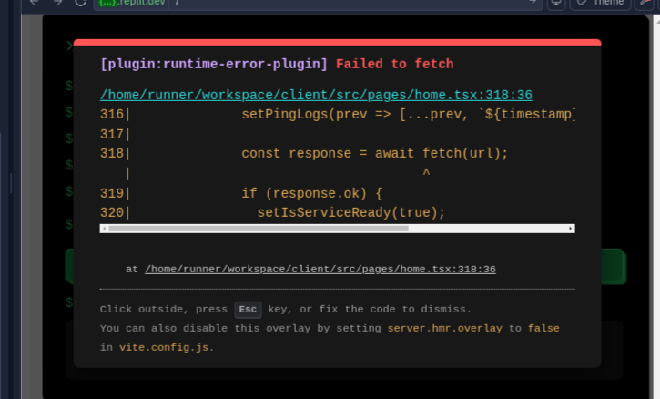

# AI Creation Lab

A full-stack web application for deploying AI models using the Spheron Protocol, built with React, Express, and TypeScript.



## Overview

AI Creation Lab is a platform that allows users to deploy AI models for image generation using Spheron Protocol's decentralized infrastructure. The application includes a modern, responsive UI built with React and a robust backend powered by Express.

## Features

- **AI Model Deployment**: Deploy Stable Diffusion WebUI with pre-configured models
- **Real-time Status Tracking**: Monitor deployment status, logs, and performance metrics
- **Spheron Protocol Integration**: Utilize Spheron's decentralized infrastructure for reliable deployments
- **Responsive UI**: Modern interface built with React, Tailwind CSS, and Shadcn UI components

## Tech Stack

### Frontend
- React 18
- TypeScript
- Tailwind CSS
- Shadcn UI components
- React Hook Form with Zod validation
- Vite for build and development

### Backend
- Express.js
- TypeScript
- Spheron Protocol SDK
- PostgreSQL with Drizzle ORM
- Zod for validation

## Getting Started

### Prerequisites

- Node.js 20+
- PostgreSQL database
- Spheron Protocol API key

### Environment Setup

1. Create a `.env` file in the root directory with the following variables:

```env
# Spheron API Key
SPHERON_PRIVATE_KEY=your_spheron_private_key

# Database connection (if using external database)
DATABASE_URL=your_database_connection_string
```

### Installation

1. Install dependencies:

```bash
npm install
```

2. Set up the database schema:

```bash
npm run db:push
```

### Development

Run the development server:

```bash
npm run dev
```

This will start both the frontend and backend servers, with the application accessible at [http://localhost:5000](http://localhost:5000).

## Project Structure

```
├── client/               # Frontend code
│   ├── src/              # React application sources
│   │   ├── components/   # UI components
│   │   ├── pages/        # Page components
│   │   └── main.tsx      # Entry point
│   └── index.html        # HTML template
│
├── server/               # Backend code
│   ├── index.ts          # Express server setup
│   ├── routes.ts         # API routes
│   ├── storage.ts        # Database operations
│   └── vite.ts           # Vite integration
│
├── shared/               # Shared code between frontend and backend
│   └── schema.ts         # Database schema and types
│
└── various config files  # Configuration files for the project
```

## Deployment

The application is configured for deployment on Replit. The deployment configuration is in the `.replit` file.

### Build for Production

```bash
npm run build
```

This will build both the frontend and backend for production.

### Run in Production

```bash
npm run start
```

## API Reference

### Endpoints

#### GET /api/balance

Returns the current CST token balance from the Spheron escrow.

**Response:**
```json
{
  "lockedBalance": "string",
  "unlockedBalance": "string",
  "totalBalance": "string"
}
```

#### POST /api/deployments

Creates a new deployment using the provided YAML configuration.

**Request Body:**
```json
{
  "name": "string",
  "yamlConfig": "string"
}
```

**Response:**
```json
{
  "deployment": {
    "id": "number",
    "name": "string",
    "status": "string",
    "webuiUrl": "string"
  },
  "transaction": {
    "leaseId": "string"
  },
  "details": {
    "status": "string",
    "provider": "string",
    "pricePerHour": "string",
    "startTime": "string",
    "remainingTime": "string",
    "services": {},
    "logs": ["string"]
  },
  "lease": {}
}
```

## YAML Configuration Examples

The application comes with pre-configured YAML files for deploying AI models:

### Image Generation (Stable Diffusion)

```yaml
version: "1.0"

services:
  sd-webui:
    image: spheronnetwork/jupyter-notebook:pytorch-2.4.1-cuda-enabled
    pull_policy: IfNotPresent
    expose:
      - port: 7860
        as: 7860
        to:
          - global: true
      - port: 8888
        as: 8888
        to:
          - global: true
    env:
      - JUPYTER_TOKEN=test
      - PYTHONUNBUFFERED=1
    command:
      - "bash"
      - "-c"
      - |
        # Installation and setup commands
```

## License

MIT

## Contributing

Contributions are welcome! Please feel free to submit a Pull Request.
